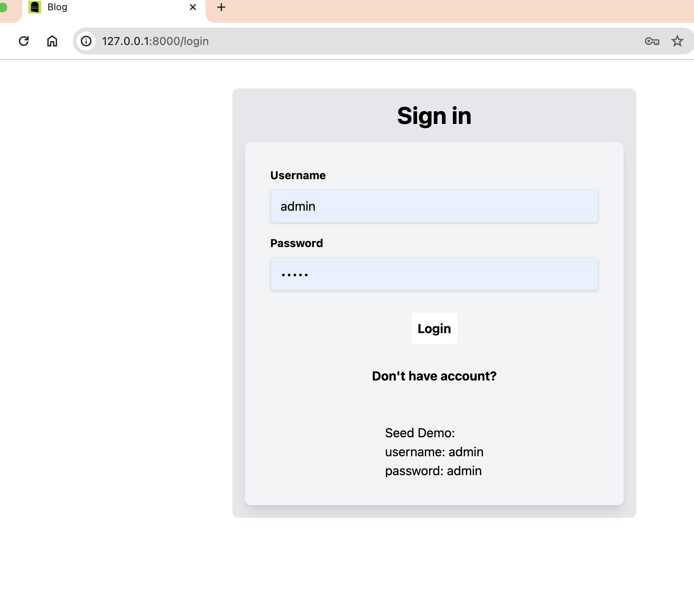
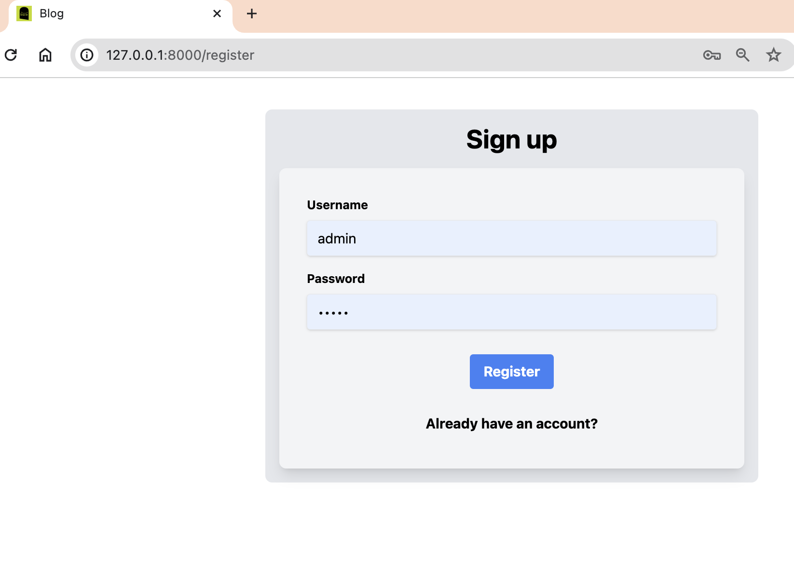
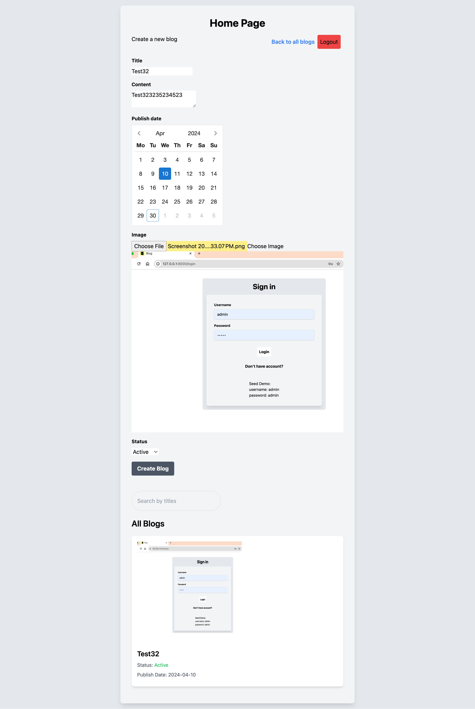
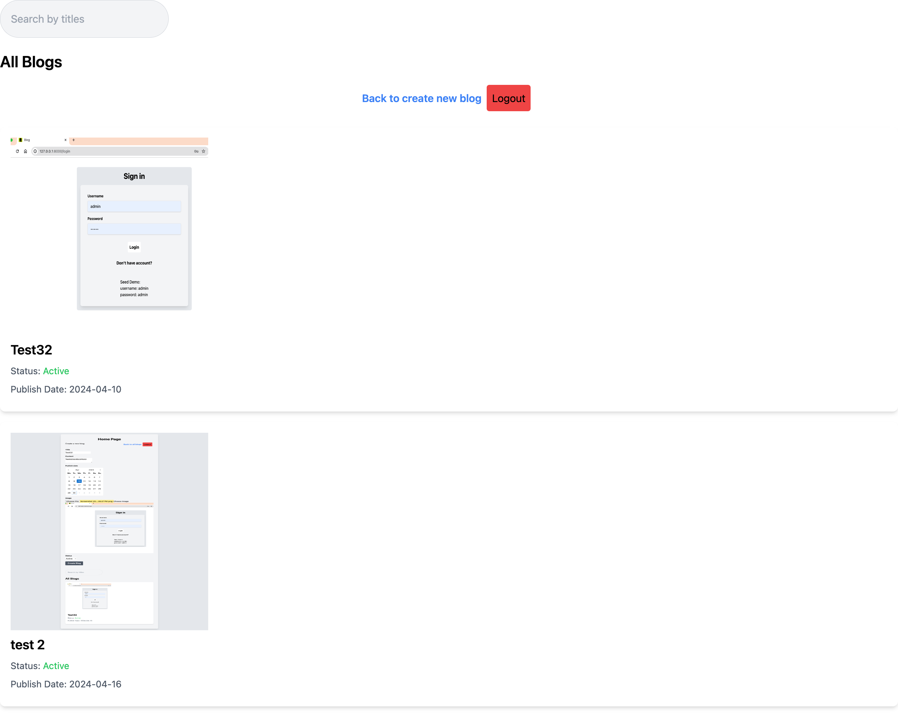
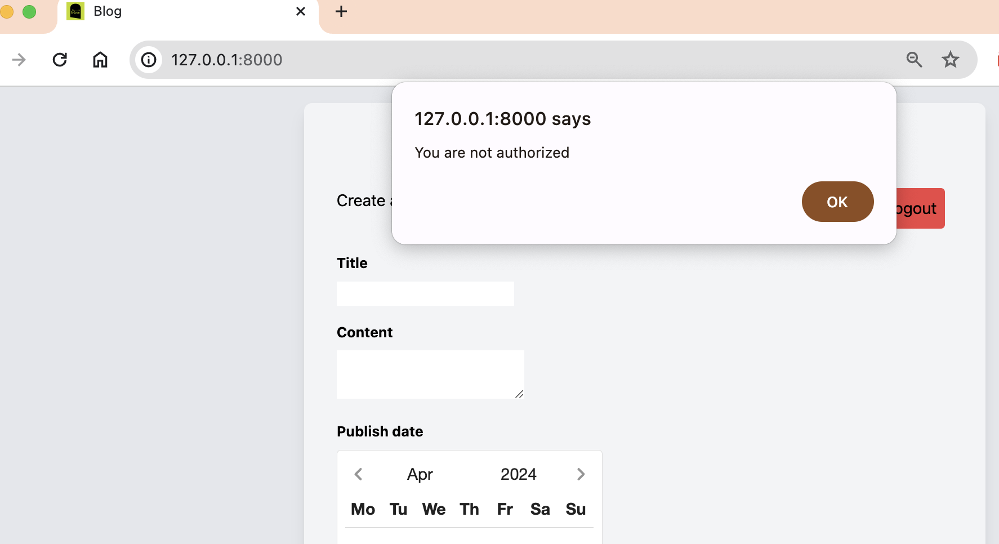
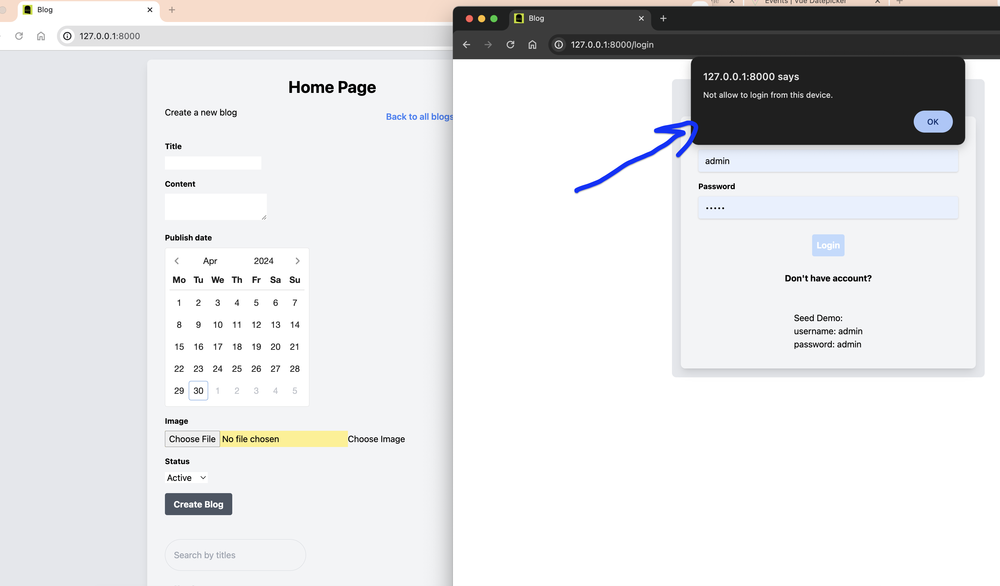

# Blog
### Blog using Laravel and Vue


### Business requirements:
- Protected blog 
- Allow user to login from only one device (first device that user used on registration) [depend on cookies] 
- CRUD with soft deletes

#### Setup

- Frontend compilation with changes watch:
    ```shell
    npm i && 
    npm run watch
    ```

- Backend:<br />

    Create new env file:<br />
    `cp .env.example .env`
    
    To start DB on docker:<br />
    `docker compose up -d --build`
    
    ```shell
     php artisan key:gen &&
     php artisan storage:link &&
     php artisan migrate:fresh --seed &&
     php artisan serv
    ```
> docker-compose is used for building a mariadb container exposed on port 3307 (if you will use it, make sure port 3307 is not in use)


---
#### Demo credentials:
<pre>
username: admin
password: admin
</pre>
---
#### Tools and packages used:
- docker
- docker-compose
- php8.2
- mysql
- laravel 10
- sanctum
- guzzle
- faker
---
- vue 3
- vuex
- vue-router
- tailwind
- vite
- axios


### Screenshots:

login:<br />
<br />
register:<br />
<br />
homepage:<br />
<br />
all-blogs:<br />
<br />
auth-token:<br />
<br />
try-login-from-other:<br />
<br />
